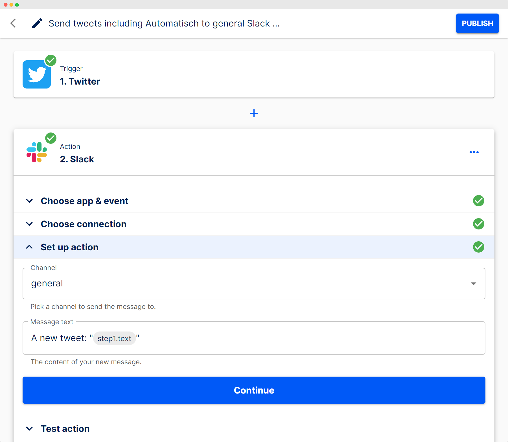

# What is Automatisch?

:::warning
Automatisch is still in the early phase of development. We try our best not to introduce breaking changes, but be cautious until v1 is released.
:::

🧐 Automatisch is a **business automation** tool that lets you connect different services like Twitter, Slack, and **[more](/guide/available-apps)** to automate your business processes.

💸 Automating your workflows doesn't have to be a difficult or expensive process. You also **don't need** any programming knowledge to use Automatisch.

## How it works?

Automatisch is a software designed to help streamline your workflows by integrating the different services you use. This way, you can avoid spending extra time and money on building integrations or hiring someone to do it for you.

For example, you can create a workflow for your team by specifying two steps: "search all tweets that include the `Automatisch` keyword" and "post those tweets into a slack channel specified." It is one of the internal workflows we use to test our product. This example only includes Twitter and Slack services, but many more possibilities exist. You can check the list of integrations [here](/guide/available-apps).

You need to prepare the workflow once, and it will run continuously until you stop it or the connected account gets unlinked. Currently, workflows run at intervals of 15 minutes, but we're planning to extend this behavior and support instant updates if it's available with the third-party service.

## Advantages

There are other existing solutions in the market, like Zapier and Integromat, so you might be wondering why you should use Automatisch.

✅ One of the main benefits of using Automatisch is that it allows you to **store your data on your own servers**, which is essential for businesses that handle sensitive user information and cannot risk sharing it with external cloud services. This is especially relevant for industries such as healthcare and finance, as well as for European companies that must adhere to the General Data Protection Regulation (GDPR).

🤓 Your contributions are vital to the development of Automatisch. As an **open-source software**, anyone can have an impact on how it is being developed.

💙 **No vendor lock-in**. If you ever decide that Automatisch is no longer helpful for your business, you can switch to any other provider, which will be easier than switching from the one cloud provider to another since you have all data and flexibility.

## Let's start!

Visit our [installation guide](/guide/installation) to setup Automatisch. It's recommended to read through all the getting started sections in the sidebar and [create your first flow](/guide/create-flow).

## Something missing?

If you find issues with the documentation or have suggestions on how to improve the documentation or the project in general, please [file an issue](https://github.com/automatisch/automatisch/issues) for us, or send a tweet mentioning the [@automatischio](https://twitter.com/automatischio) Twitter account.
